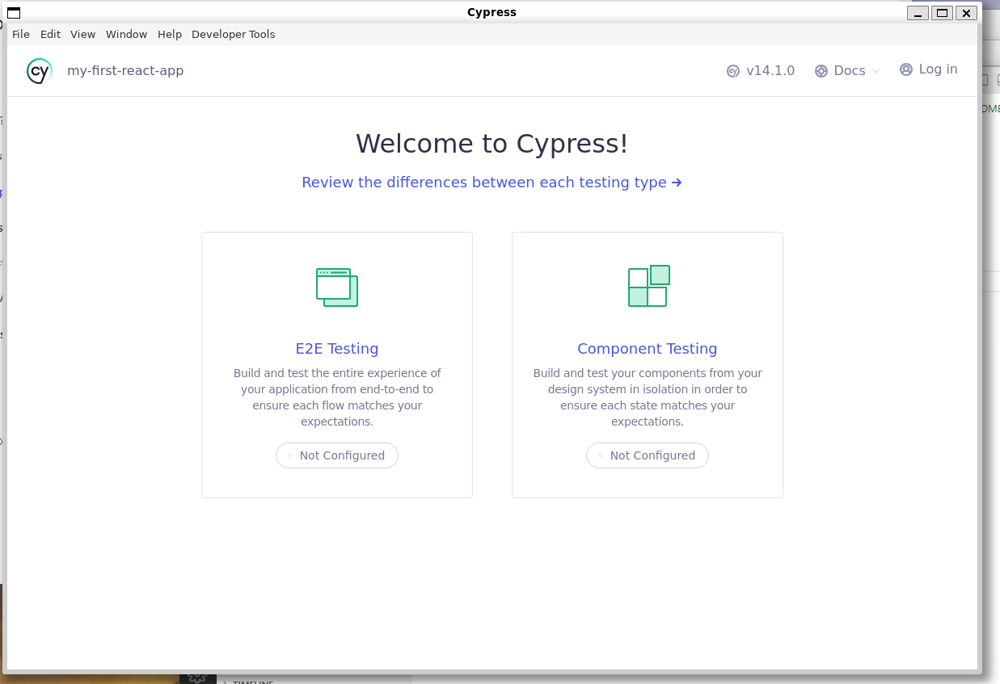
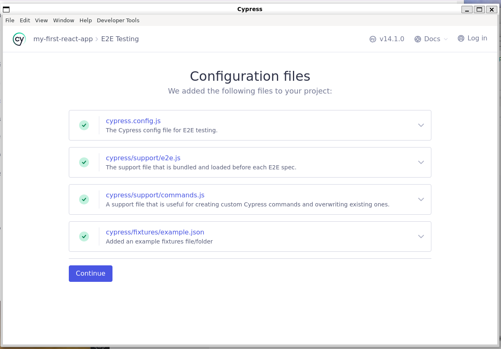
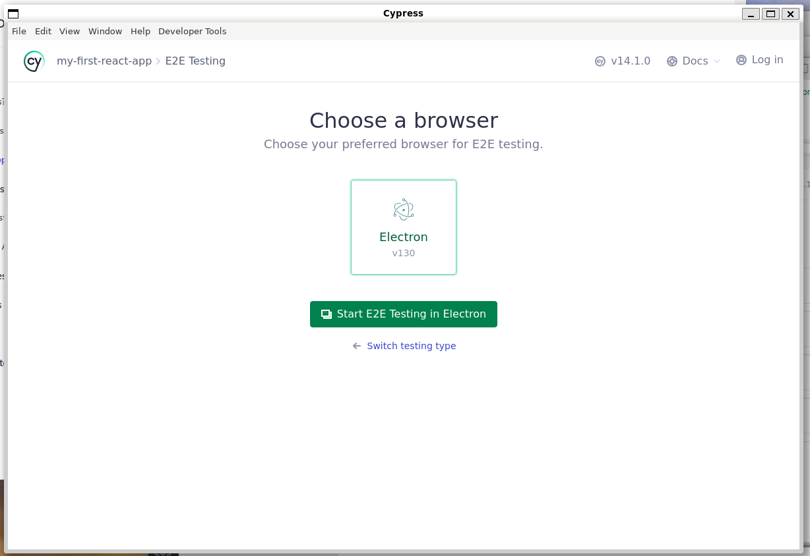
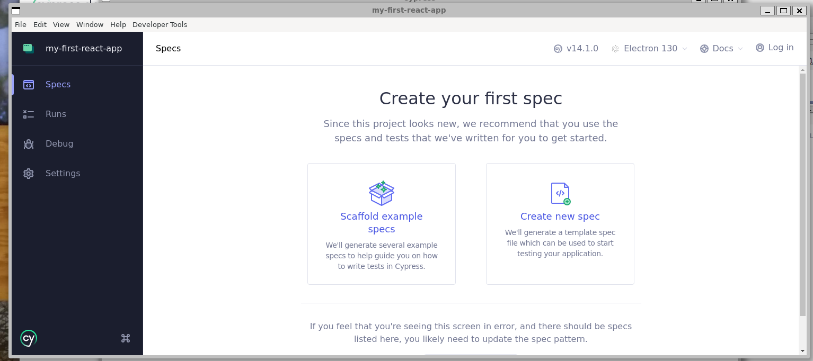
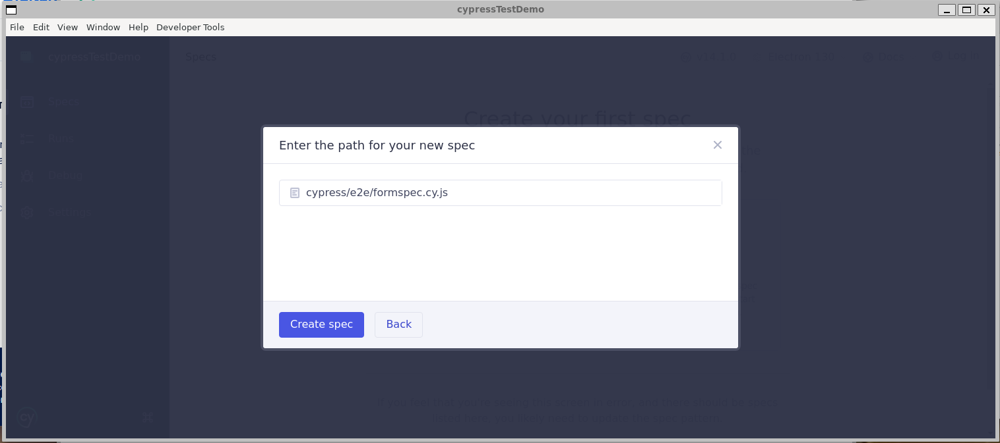
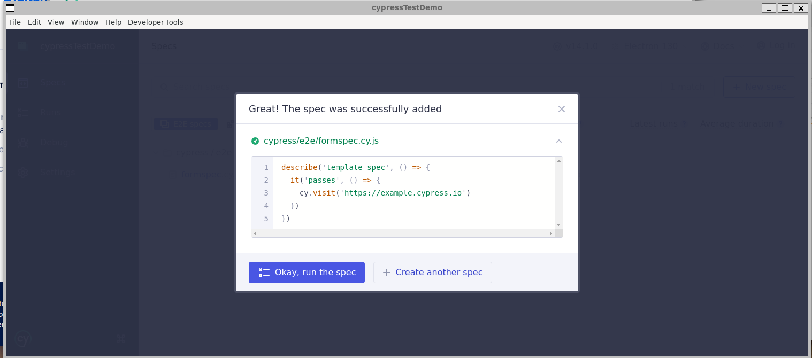

# Cypress

## Learning Goals

- [ ] **Set up Cypress for end-to-end and component testing**
- [ ] **Write Cypress tests to interact with UI elements**
- [ ] **Use Cypress commands to fill out and submit forms**
- [ ] **Assert the presence and visibility of elements**
- [ ] **Test dynamic content updates after user actions**
- [ ] **Use `data-cy` attributes for stable test selectors**
- [ ] **Simulate user interactions like clicks, typing, and selections**
- [ ] **Validate form submission and UI state changes**
- [ ] **Check for conditional rendering and dynamic lists**
- [ ] **Debug and analyze Cypress test failures using logs and snapshots**

## End-to-End Testing

End-to-End (E2E) Testing allows us to test our application by simulating real-world user interactions. These tests verify that the entire system—from the frontend to the backend, database, and external services—works together as expected. E2E tests are typically longer and more complex than unit or integration tests, as they assess the full functionality of a feature from start to finish. They help catch issues that only arise when different parts of the application interact, ensuring a seamless user experience.

## Cypress

[Cypress Docs](https://docs.cypress.io/app/get-started/why-cypress)

Cypress is a **test runner** that makes **end-to-end (E2E) testing approachable and seamless** by providing a fast, reliable, and developer-friendly testing experience. It allows us to write tests that mimic real user interactions, ensuring our application works as expected across different scenarios.

### **Best Practices for Using Cypress**

1. **Use Separate Servers for Development and Testing**  
   The development server and the server running Cypress tests should be **different**. This ensures that running tests doesn't interfere with active development and helps isolate test environments for more reliable results.

2. **Use `data-cy` Attributes for Selecting Elements**  
   While Cypress allows selecting elements using various selectors (`id`, `class`, `name`, etc.), the **best practice is to use `data-cy` attributes**. These attributes are specifically designated for testing and are:

- **Stable:** Less likely to change compared to class names or styles.
- **Purpose-Built:** Clearly indicate an element is being used for testing.
- **Prevent Overwrites:** Avoid accidental changes that could break tests.

By following these best practices, we can create **robust, maintainable, and efficient tests** that enhance the stability and reliability of our application.

### **3. No Little Tests**

Unlike unit tests, end-to-end (E2E) tests are longer and meant to verify multiple aspects of a specific feature. Each test suite should cover a complete user flow, testing a feature from start to finish to ensure it works as expected in a real-world scenario.

## Lab Deliverables

0. Pre-configuration:
   To set up and run Cypress while starting your development server, follow these steps:

#### **Terminal 1: Start the Development Server**

- Run `npm i` to install dependencies.
- Start the development server with `npm run start`.

#### **Terminal 2: Install and Open Cypress**

- Install Cypress as a development dependency using `npm install cypress --save-dev`.
- Open the Cypress Test Runner with `npx cypress open`.

1. Generate testing enviorment
   
   Select E2E Testing
   
   Select Continue
   
   Select Electorn (This is a browser that cypress uses for testing)
   
   Select Create New Spec
   
   Name the new spec formspec and select `create spec`
   
   Select okay, `run the spec`

2. **Updating Cypress Test Setup**

- A new folder called `cypress` has been created. Open the folder, navigate to the `e2e` directory, and open `formspec.cy.js`.
- Update `cy.visit()` to point to the correct URL of your React application.
- Rename the `describe` block to an appropriate name that reflects the test suite.
- Change the `it` block to a `beforeEach()` function. Everything inside this block will run before every test case.

<details>
  <summary>Click Here to view solution</summary>

```
describe("Submits a rating", () => {
  beforeEach(() => {
    cy.visit("http://localhost:3000/");
  });
});


```

</details>

3. **Add a test suit**

- Add an `it` block with a descriptive string as the first argument.
- Pass a callback function as the second argument.

<details>
  <summary>Click Here to view solution</summary>

```
it("Creates a booking", () => {})


```

</details>

4. **Adding data attributes**

- Add `data-cy` attributes to form elements to make them easier to select in Cypress tests.
- Example: Add `data-cy="input-name"` to the name input field.

<details>
  <summary>Click Here to view solution</summary>

```
AddRestaurant.jsx
 <form data-cy="rating-form" onSubmit={handleSubmit}>
      <div>
        <label>Name:</label>
        <input
          data-cy="input-name"
          type="text"
          name="name"
          value={formData.name}
          onChange={handleChange}
          required
        />
      </div>

      <div>
        <label>Address:</label>
        <input
          data-cy="input-address"
          type="text"
          name="address"
          value={formData.address}
          onChange={handleChange}
          required
        />
      </div>

      <div>
        <label>Phone:</label>
        <input
          data-cy="input-phone"
          type="tel"
          name="phone"
          value={formData.phone}
          onChange={handleChange}
          required
        />
      </div>

      <div>
        <label>Cuisine:</label>
        <input
          data-cy="input-cuisine"
          type="text"
          name="cuisine"
          value={formData.cuisine}
          onChange={handleChange}
          required
        />
      </div>

      <div>
        <label>Rating:</label>
        <input
          data-cy="input-rating"
          type="number"
          name="rating"
          min="1"
          max="5"
          value={formData.rating}
          onChange={handleChange}
          required
        />
      </div>


```

</details>

5. **Use Cypress to Fill Out the Form**

- Use `cy.get()` to select the input fields using their `data-cy` attributes.
- Example: `cy.get('[data-cy="input-name"]')`
- Chain a `.type()` command to each input field and provide a string to be entered into the form.

<details>
  <summary>Click Here to view solution</summary>

```
    cy.get('[data-cy="input-name"]').type('Pizza House');
    cy.get('[data-cy="input-address"]').type('123r PL NE, Seattle, USA');
    cy.get('[data-cy="input-phone"]').type('111-123-1234');
    cy.get('[data-cy="input-cuisine"]').type('Italian');
    cy.get('[data-cy="input-rating"]').type('5');


```

</details>

6. **Submit the form and verify the rating is posting**

- Submit the form by selecting the form element using its `data-cy` attribute and calling `.submit()`.
- Verify the rating has posted by checking if the restaurant component appears with the correct details.
  - Locate the restaurant entry in the list using `data-cy`.
  - Use `.within()` to scope the test to that specific restaurant.
  - Assert that each restaurant detail (address, phone, cuisine, and rating) is correctly displayed.

<details>
    <summary>Click Here to view solution</summary>

```
 cy.get('data-cy="rating-form"').submit();
   cy.get(`[data-cy="Pizza House"] ul`).within(() => {
      cy.contains('li', '123r PL NE, Seattle, USA').should('be.visible');
      cy.contains('li', '111-123-1234').should('be.visible');
      cy.contains('li', 'Italian').should('be.visible');
      cy.contains('li', '5').should('be.visible');
    });

```

</details>
